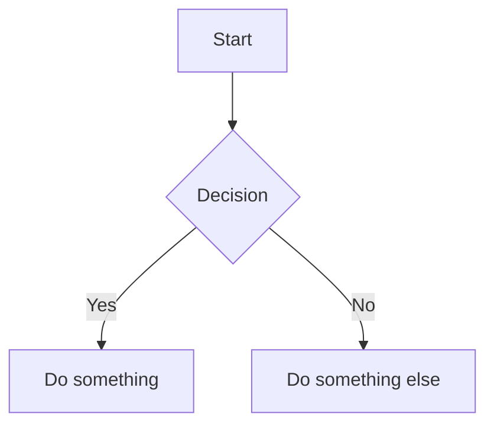
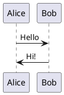
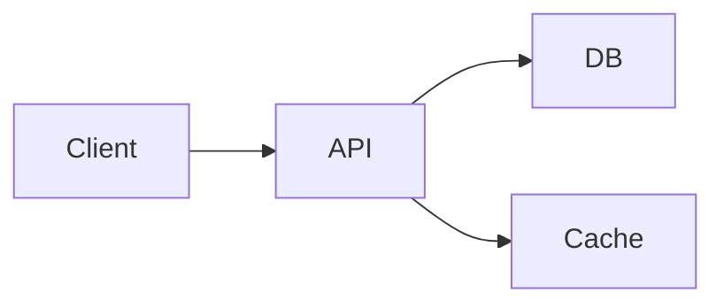

# Presentations

Create slide decks using [Slidev](https://sli.dev), a markdown-based presentation tool for developers. Write slides in markdown, get beautiful results with code highlighting, animations, and Vue components.

For a complete example showing all features, see [reference-slide-example.md](./reference-slide-example.md).

## Setup

```bash
npm init slidev@latest
```

Or add to an existing project:

```bash
npm install @slidev/cli @slidev/theme-default
```

Run the dev server:

```bash
npx slidev
```

## Basic structure

Slides are written in a single `slides.md` file. Separate slides with `---`:

```md
---
theme: seriph
background: https://cover.sli.dev
class: text-center
---

# My Presentation

Subtitle goes here

---

# Second Slide

Content for the second slide
```

## Frontmatter

Each slide can have frontmatter for configuration:

```yaml
---
layout: two-cols
transition: slide-left
class: px-20
---
```

Global frontmatter goes at the top of the file and applies to all slides.

## Layouts

Slidev has built-in layouts:

- `default` - basic slide
- `center` - centered content
- `two-cols` - two column layout (use `::right::` to separate)
- `image-right` / `image-left` - image on one side
- `cover` - title slide
- `section` - section divider
- `quote` - for quotations
- `fact` - highlight a key fact

Example two-column layout:

```md
---
layout: two-cols
---

# Left Column

Content here

::right::

# Right Column

More content
```

## Code blocks

Code highlighting works out of the box with Shiki:

````md
```ts {2|3-4|all}
const greeting = "Hello";
const name = "World";
console.log(`${greeting}, ${name}!`);
```
````

The `{2|3-4|all}` syntax creates click-through highlighting:

- First click highlights line 2
- Second click highlights lines 3-4
- Third click shows all

### Magic Move

Animate between code states:

`````md
````md magic-move
```ts
// Step 1
const count = ref(0);
```

```ts
// Step 2
const count = ref(0);
const doubled = computed(() => count.value * 2);
```
````
`````

`````

### Monaco Editor

Make code blocks editable:

````md
```ts {monaco}
const x = 1 + 1
```
`````

Or runnable:

````md
```ts {monaco-run}
console.log("This runs in the browser!");
```
````

## Animations

### Click animations

Use `v-click` to reveal elements on click:

```html
<div v-click>This appears on first click</div>
<div v-click>This appears on second click</div>
```

Or with numbered order:

```html
<div v-click="3">This appears third</div>
<div v-click="1">This appears first</div>
<div v-click="2">This appears second</div>
```

### Marks and highlights

```html
<span v-mark.red="2">Highlighted on click 2</span>
<span v-mark.circle.orange>Circled</span>
<span v-mark.underline.blue>Underlined</span>
```

### Motion

Use `v-motion` for entrance animations:

```html
<div v-motion :initial="{ x: -80, opacity: 0 }" :enter="{ x: 0, opacity: 1 }">
  Slides in from left
</div>
```

## Diagrams

Mermaid diagrams work directly in markdown:

````md

````

PlantUML also supported:

````md

````

## LaTeX

Math is supported via KaTeX:

```md
Inline: $E = mc^2$

Block:

$$
\int_0^\infty e^{-x^2} dx = \frac{\sqrt{\pi}}{2}
$$
```

## Themes

Change theme in frontmatter:

```yaml
---
theme: seriph
---
```

Popular themes: `default`, `seriph`, `apple-basic`, `dracula`, `shibainu`

Browse themes: https://sli.dev/resources/theme-gallery

## CLI Reference

### Development

```bash
# Start dev server (default: slides.md on port 3030)
slidev

# Custom entry file
slidev my-slides.md

# Custom port and auto-open browser
slidev --port 8080 --open

# Enable remote access (for presenting from another device)
slidev --remote

# Remote with password protection
slidev --remote mypassword
```

### Building

```bash
# Build as hostable SPA
slidev build

# Custom output directory
slidev build --out ./public

# Include PDF download button in SPA
slidev build --download

# Exclude speaker notes
slidev build --without-notes
```

### Exporting

```bash
# Export to PDF (default)
slidev export

# Export to PowerPoint
slidev export --format pptx

# Export to PNG (one image per slide)
slidev export --format png

# Export to markdown
slidev export --format md

# Export specific slides
slidev export --range "1,4-5,6"

# Export with click animations (one page per click)
slidev export --with-clicks

# Export dark theme version
slidev export --dark

# Custom output filename
slidev export --output my-presentation
```

### Other commands

```bash
# Format markdown file
slidev format

# Eject theme to local files for customization
slidev theme eject
```

## Speaker notes

Add notes with HTML comments at the end of a slide:

```md
---

# My Slide

Content here

<!--
These are speaker notes.
Only visible in presenter mode.
Press 'p' to toggle presenter view.
-->
```

## Custom components

Create Vue components in `components/` folder and use them directly:

```md
<MyCustomChart :data="chartData" />
```

## Generating images for slides

Use nanobanana to generate custom images:

```bash
# Generate a diagram
nanobanana diagram "user authentication flow" --type=flowchart

# Generate an icon
nanobanana icon "rocket launch" --style=minimal

# Generate a background
nanobanana pattern "subtle gradient mesh" --type=wallpaper
```

Then reference in your slides:

```md
---
background: ./nanobanana-output/subtle_gradient_mesh.png
---
```

## Example slide deck

````md
---
theme: seriph
background: https://cover.sli.dev
class: text-center
transition: slide-left
---

# Project Update

Q1 2026 Review

---

## layout: two-cols

# What we shipped

- Feature A
- Feature B
- Feature C

::right::

# Metrics

- 50% faster
- 2x more users
- 99.9% uptime

---

# Architecture


````

---

layout: center
class: text-center

---

# Questions?

[docs](https://example.com) · [github](https://github.com/example)

```

## Tips

- Keep slides simple. One idea per slide.
- Use code highlighting to walk through complex code.
- Leverage diagrams instead of bullet points when showing processes.
- Generate custom images rather than using stock photos.
- Practice with presenter mode (`p` key) to see notes and upcoming slides.
- Export to PDF for sharing, keep the source for presenting live.

## Documentation

Full Slidev docs: https://sli.dev/llms.txt

Key references:
- [Syntax Guide](https://sli.dev/guide/syntax) - Markdown extensions, frontmatter, slots
- [Animations](https://sli.dev/guide/animations) - Click animations, motion, transitions
- [Layouts](https://sli.dev/builtin/layouts) - All built-in layouts
- [Components](https://sli.dev/builtin/components) - Built-in Vue components
- [Themes](https://sli.dev/resources/theme-gallery) - Theme gallery
- [CLI Reference](https://sli.dev/builtin/cli) - All CLI commands and options

Features worth exploring:
- [Shiki Magic Move](https://sli.dev/features/shiki-magic-move) - Animate code changes
- [Monaco Editor](https://sli.dev/features/monaco-editor) - Live code editing in slides
- [Drawing](https://sli.dev/features/drawing) - Annotate slides during presentation
- [Recording](https://sli.dev/features/recording) - Record presentations with camera
- [Remote Access](https://sli.dev/features/remote-access) - Control from another device
```
