# Impeccable

Design skills, commands, and anti-patterns for impeccable frontend design with AI coding assistants. Based on [Impeccable](https://github.com/pbakaus/impeccable) by Paul Bakaus.

> **1 skill, 20 commands, curated anti-patterns.** Every LLM learned from the same generic templates. Without guidance, you get the same predictable mistakes: Inter font, purple gradients, cards nested in cards, gray text on colored backgrounds. Impeccable fights that bias.

## What's Included

### The Skill: frontend-design

A comprehensive design skill with 7 domain-specific references ([view skill](skills/frontend-design/SKILL.md)):

| Reference | Covers |
|-----------|--------|
| [typography](skills/frontend-design/reference/typography.md) | Type systems, font pairing, modular scales, OpenType |
| [color-and-contrast](skills/frontend-design/reference/color-and-contrast.md) | OKLCH, tinted neutrals, dark mode, accessibility |
| [spatial-design](skills/frontend-design/reference/spatial-design.md) | Spacing systems, grids, visual hierarchy |
| [motion-design](skills/frontend-design/reference/motion-design.md) | Easing curves, staggering, reduced motion |
| [interaction-design](skills/frontend-design/reference/interaction-design.md) | Forms, focus states, loading patterns |
| [responsive-design](skills/frontend-design/reference/responsive-design.md) | Mobile-first, fluid design, container queries |
| [ux-writing](skills/frontend-design/reference/ux-writing.md) | Button labels, error messages, empty states |

### Anti-Patterns

The skill includes explicit guidance on what to avoid:

- Don't use overused fonts (Arial, Inter, system defaults)
- Don't use gray text on colored backgrounds
- Don't use pure black/gray (always tint)
- Don't wrap everything in cards or nest cards inside cards
- Don't use bounce/elastic easing (feels dated)
- Don't default to dark mode with glowing accents
- Don't use gradient text for "impact"

---

## Commands

### `/audit` - Technical Quality Checks

Run systematic quality checks across accessibility, performance, theming, responsive design, and anti-patterns. Generates a scored report with P0-P3 severity ratings.

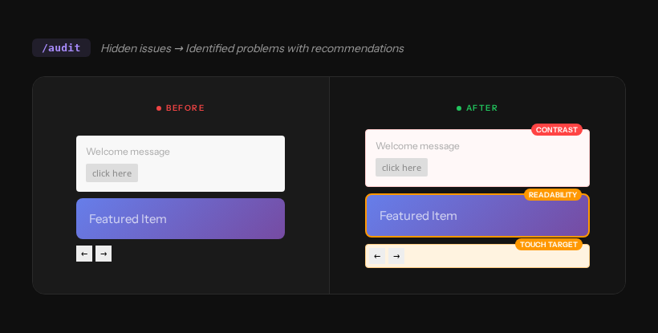

---

### `/critique` - UX Design Review

Evaluate design from a UX perspective. Scores against Nielsen's 10 heuristics with persona-based testing and actionable feedback.

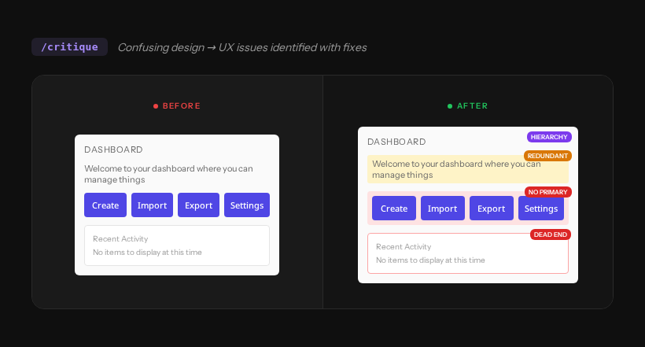

---

### `/normalize` - Align with Design System

Fix inconsistent styles by applying systematic design tokens. Same spacing, same typography, same border radius everywhere.

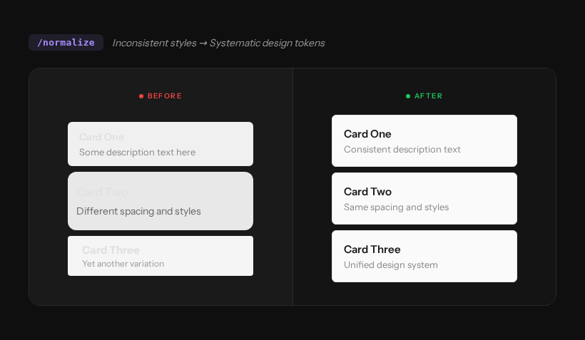

---

### `/polish` - Final Pass Before Shipping

Meticulous final pass catching alignment, spacing, consistency, and micro-detail issues. The difference between shipped and polished.

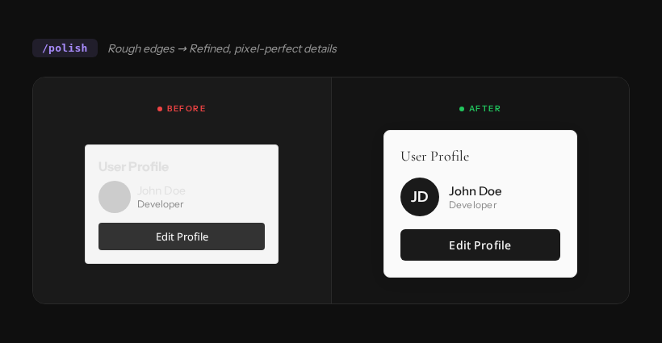

---

### `/distill` - Strip to Essence

Remove clutter, redundant elements, and noise. Focus on what matters by cutting everything that doesn't earn its place.

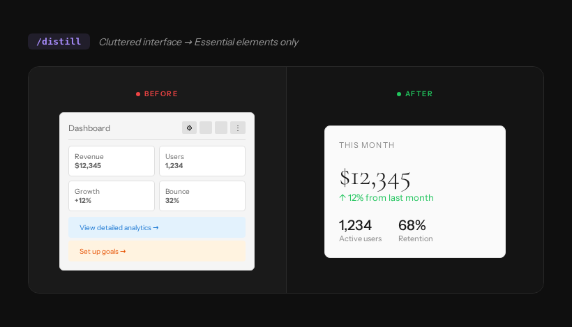

---

### `/clarify` - Improve UX Copy

Replace vague, wordy, or confusing copy with clear, actionable language. Every word earns its place.

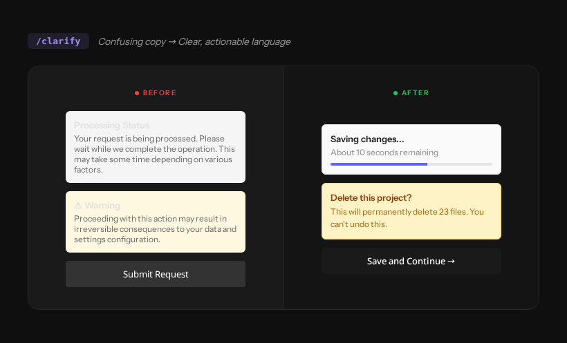

---

### `/optimize` - Performance Improvements

Reduce bundle size, render time, and layout shifts. Target specific performance bottlenecks with measurable improvements.


---

### `/harden` - Error Handling & Edge Cases

Add robust error handling, helpful error messages, input validation, and graceful degradation for edge cases.


---

### `/animate` - Add Purposeful Motion

Review a feature and enhance it with choreographed animations, micro-interactions, and motion that improves usability.

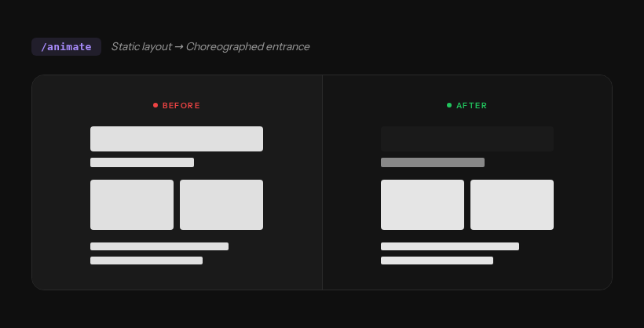

---

### `/colorize` - Introduce Strategic Color

Transform monochrome interfaces with harmonious, purposeful color that communicates state and guides attention.

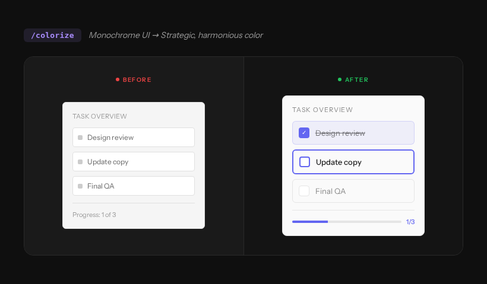

---

### `/bolder` - Amplify Boring Designs

Take timid, generic designs and give them confidence with stronger typography, bolder layout, and intentional presence.

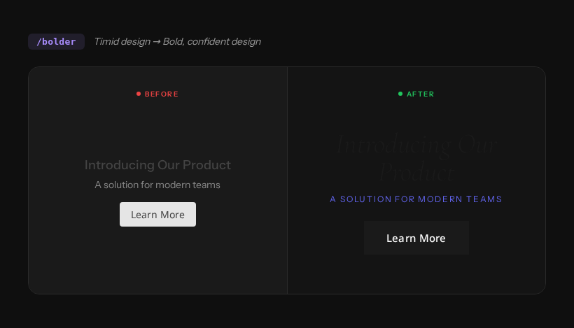

---

### `/quieter` - Tone Down Overly Bold Designs

Transform overwhelming, loud designs into calm, focused interfaces that respect the user's attention.

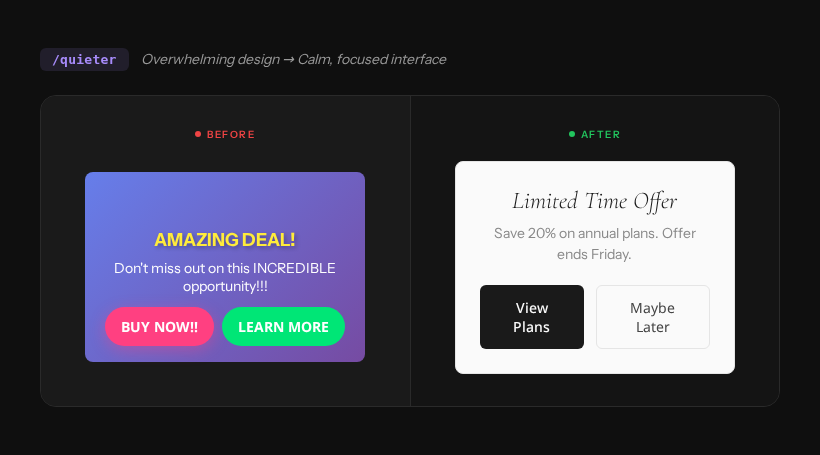

---

### `/delight` - Add Moments of Joy

Transform functional feedback into celebrations. Milestones, achievements, and success moments that make users smile.

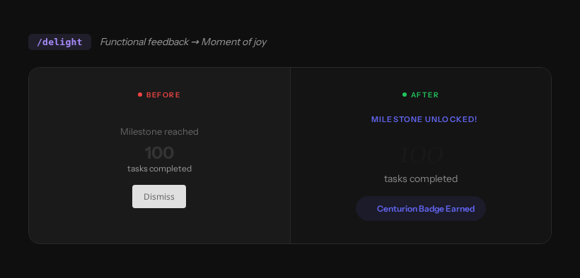

---

### `/extract` - Pull Into Reusable Components

Identify scattered styles and patterns, then extract them into documented design tokens and reusable components.

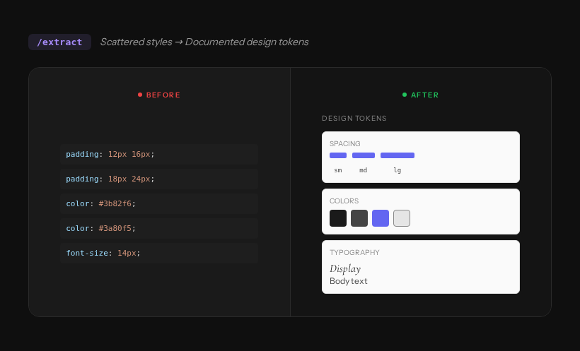

---

### `/adapt` - Adapt for Different Devices

Transform fixed desktop-only layouts into responsive designs that work beautifully across mobile, tablet, and desktop.

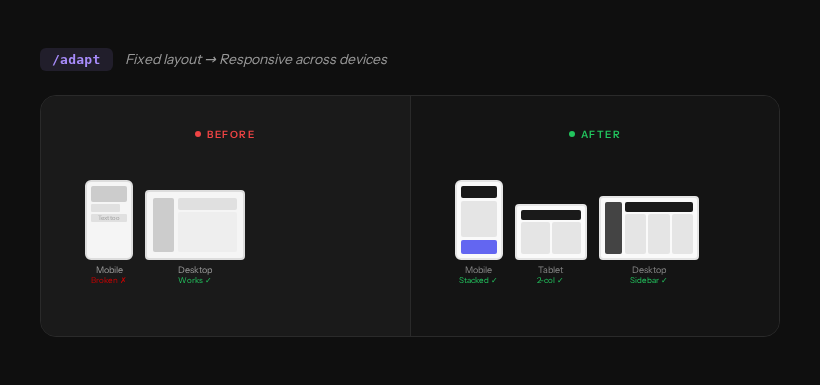

---

### `/onboard` - Design Onboarding Flows

Replace empty states and dead ends with guided onboarding experiences that teach the interface and drive action.

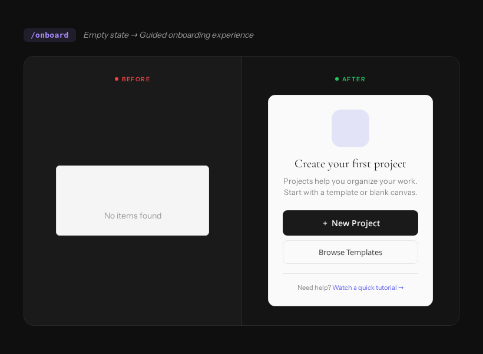

---

### `/typeset` - Fix Font Choices & Hierarchy

Transform flat, hierarchy-less text into intentional typography with clear visual hierarchy and purposeful font pairing.

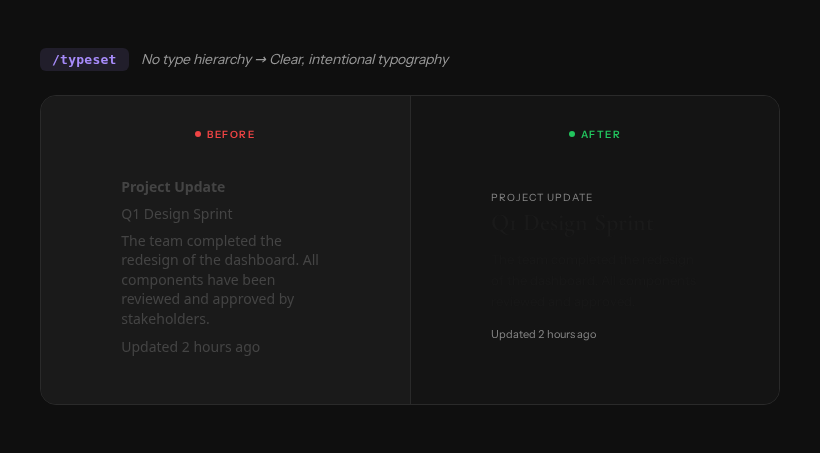

---

### `/arrange` - Fix Layout & Visual Rhythm

Replace monotonous equal spacing with intentional rhythm, grouping, and hierarchy that guides the eye.

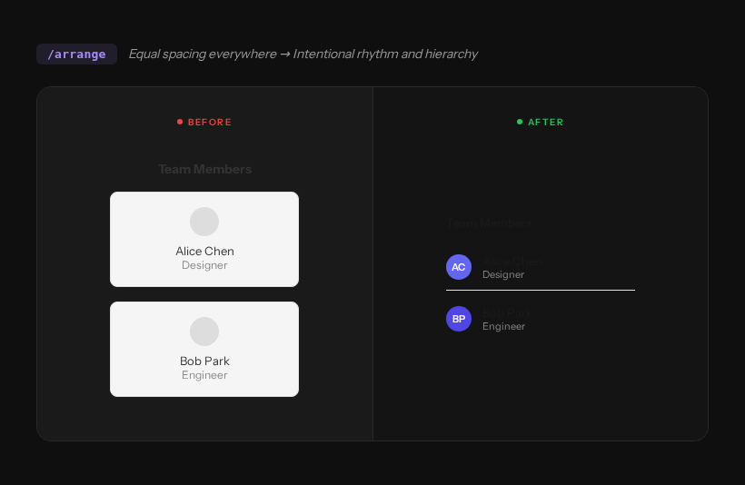

---

### `/overdrive` - Extraordinary Visual Effects

Add technically extraordinary effects that push the boundaries of what's possible in the browser.

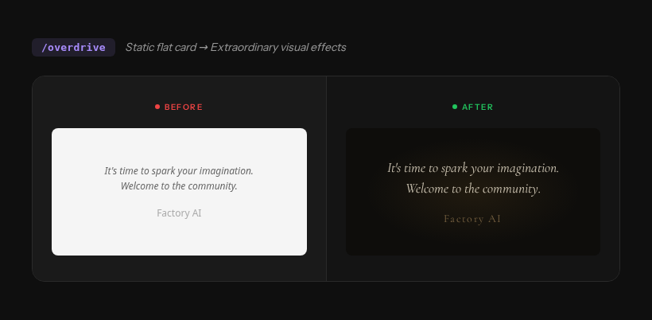

---

### `/teach-impeccable` - One-Time Setup

Gather design context (audience, brand, tone) and save to config. All other commands use this context automatically.

**When to run:**
1. Once per project, before using other commands
2. Again if your brand or design direction changes

---

## Combining Commands

Commands can be chained for a complete workflow:

```
/audit /normalize /polish blog    # Full workflow: audit -> fix -> polish
/critique /harden checkout        # UX review + add error handling
/distill /typeset /colorize       # Simplify, fix type, add color
```

## License

Apache 2.0. See [LICENSE](LICENSE).

This project is derived from [Impeccable](https://github.com/pbakaus/impeccable) by Paul Bakaus (Apache 2.0), which builds on [Anthropic's frontend-design skill](https://github.com/anthropics/skills/tree/main/skills/frontend-design) (Apache 2.0). See [NOTICE.md](NOTICE.md) for full attribution.
