# Pixel Perfect

Browser-native visual QA, design skills, and anti-pattern detection for frontend interfaces. Uses real screenshots, live rendering, and multi-viewport testing to catch what code review can't.

> Built for [Factory Droid](https://factory.ai) with `agent-browser` integration. Code review finds bugs in logic. Pixel Perfect finds bugs in pixels.

## What Makes This Different

Most design linting happens in code. Pixel Perfect opens a real browser, takes real screenshots, and tests what users actually see. A button can pass every linter and still have 2.1:1 contrast, a 28x18px touch target, and no focus ring -- invisible in code, obvious in a screenshot.

## Commands

### Browser-Native (New)

#### `/visual-qa` - Real Rendered Inspection

Opens the page in a real browser, screenshots at mobile/tablet/desktop, checks contrast ratios on rendered elements, measures touch targets, detects overflow, and tests focus indicators. Produces an annotated visual report.

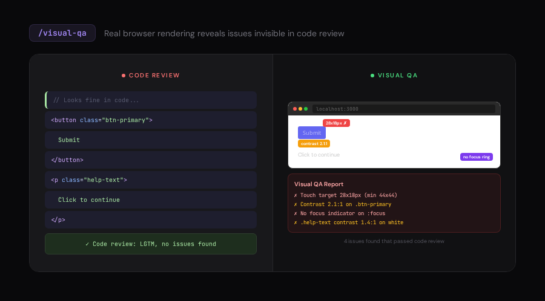

---

#### `/screenshot-diff` - Visual Regression Detection

Takes before/after screenshots and produces a pixel diff. Catches unintended regressions at every viewport. Compare two URLs side-by-side or track changes across edits.

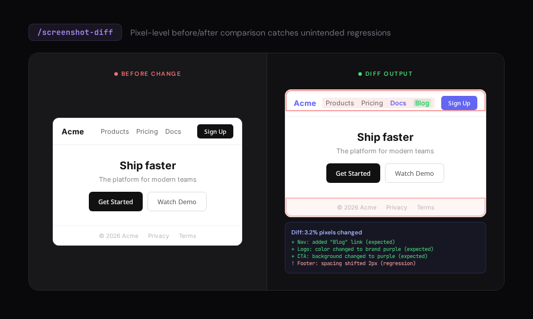

---

### Design Skills

#### `/audit` - Technical Quality Checks

Scores accessibility, performance, theming, responsive design, and anti-patterns (0-20). Now includes browser verification: multi-viewport screenshots, rendered contrast checks, and ARIA scanning.

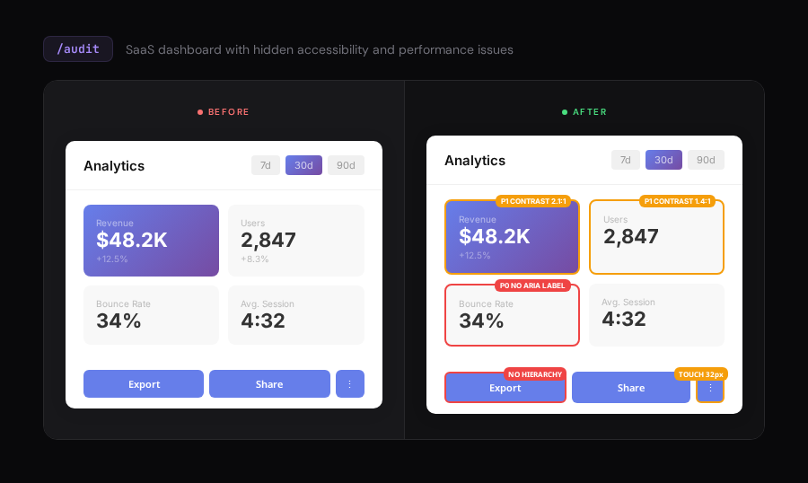

---

#### `/critique` - UX Design Review

Nielsen's 10 heuristics scoring (0-40) with screenshot-first analysis. Tests actual user flows via browser interaction, not hypothetical walkthroughs.

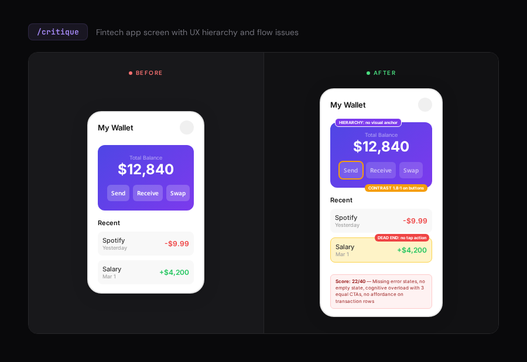

---

#### `/polish` - Final Pass Before Shipping

Pixel-perfect alignment, spacing rhythm, interaction state testing. Uses before/after screenshots and actually hovers, focuses, and clicks elements to verify every state.

---

#### `/normalize` - Design System Alignment

Scans for inconsistent tokens, screenshots components side-by-side, applies systematic fixes. Verifies visually that normalized components still look intentional.

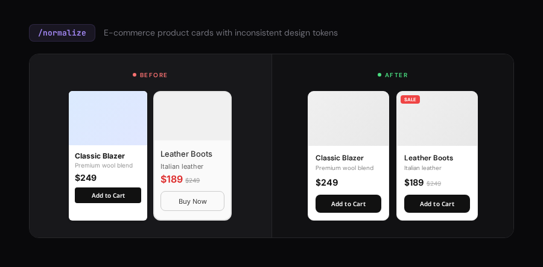

---

#### `/distill` - Strip to Essence

Removes clutter, redundant elements, and noise. Verifies with before/after screenshots that nothing essential was lost.

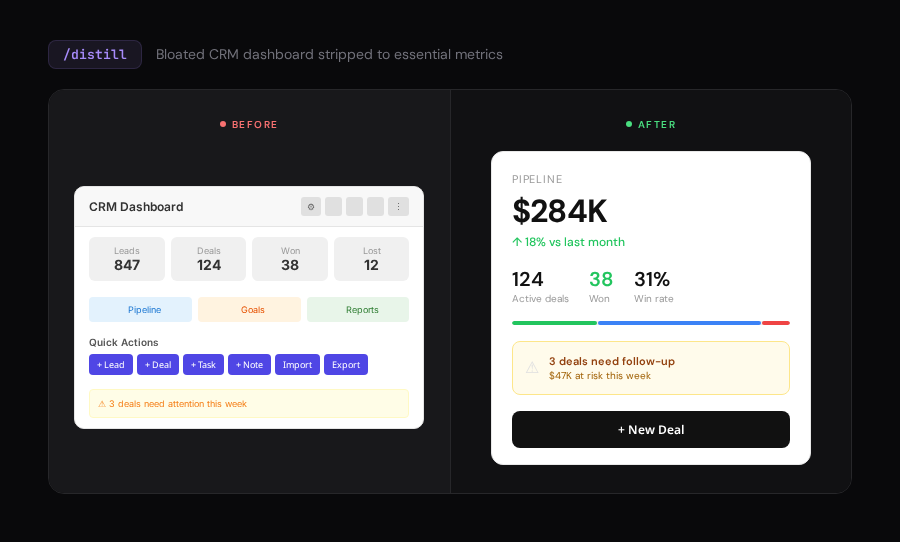

---

#### `/clarify` - Improve UX Copy

Fixes vague errors, confusing labels, and wordy instructions. Reads actual rendered text in browser context.

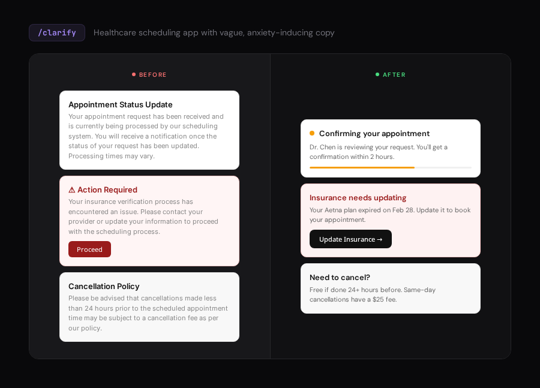

---

#### `/optimize` - Performance

Measures real Core Web Vitals (LCP, FID, CLS), profiles runtime performance, checks image sizes and lazy loading. Before/after measurements.

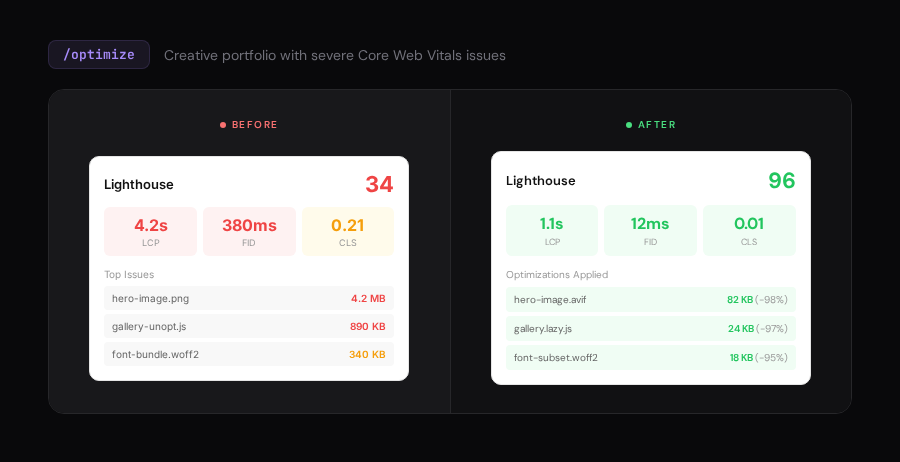

---

#### `/harden` - Error Handling & Edge Cases

Tests with extreme inputs (long text, emoji, RTL), offline mode, slow networks, and bad form data -- all via real browser interaction.

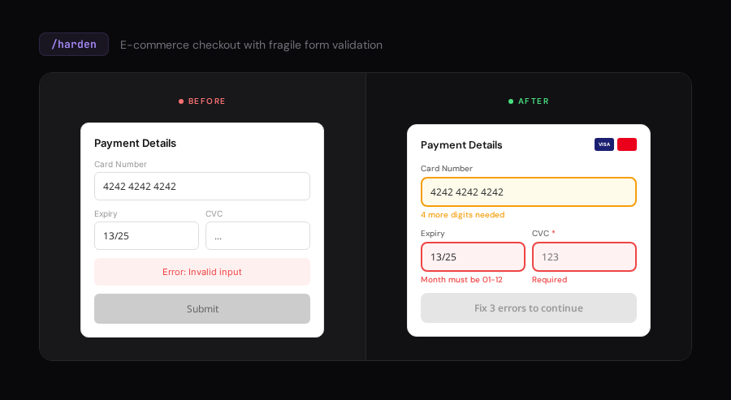

---

#### `/animate` - Motion Design

Choreographed animations, micro-interactions, and celebration moments. Previews in browser, records demos, tests `prefers-reduced-motion`, verifies 60fps.

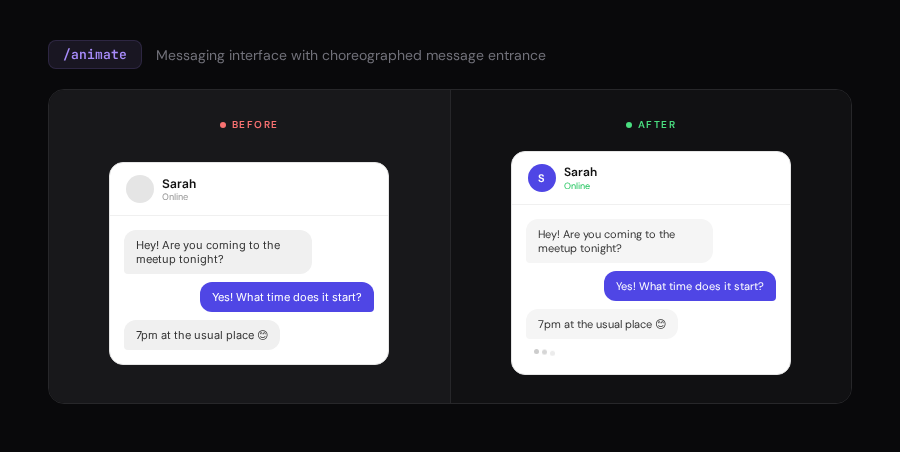

---

#### `/colorize` - Strategic Color

Transforms monochrome UIs with purposeful color. Checks contrast ratios on rendered elements and simulates colorblind vision.

---

#### `/typeset` - Typography

Fixes flat hierarchy, poor readability, and bad font choices. Verifies font rendering (no FOUT/FOIT) and line lengths in screenshots.

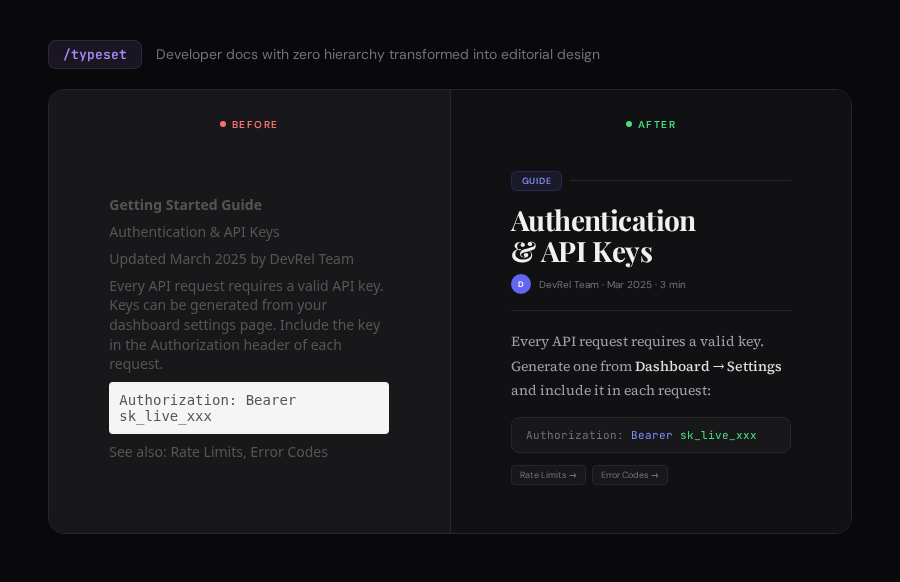

---

#### `/adapt` - Responsive Design

Screenshots at every breakpoint, tests touch targets, detects horizontal overflow, and verifies orientation changes -- all in a real browser.

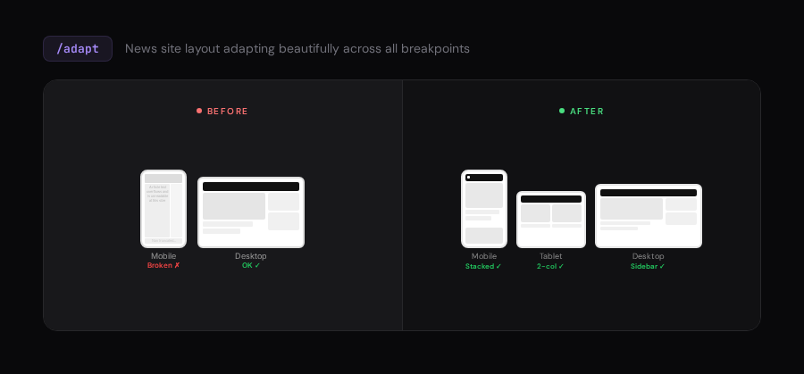

---

### The Skill: frontend-design

The foundational skill loaded by all commands. Includes:
- Typography, color, layout, motion, interaction, responsive, and UX writing guidelines
- 7 domain-specific reference documents
- Curated anti-patterns (the "AI Slop Test")
- DO/DON'T patterns for every design dimension

### Cut from Impeccable

These commands were removed as redundant:
- `/delight` -- merged into `/animate` (celebration moments)
- `/bolder` + `/quieter` -- subjective taste toggles, covered by `/polish`
- `/arrange` -- spacing/rhythm work merged into `/polish`
- `/extract` -- design system extraction is a dev task
- `/teach-impeccable` -- replaced by `.pixel-perfect.md` config file
- `/overdrive` -- too niche
- `/onboard` -- too narrow

## Attribution

Apache 2.0. Design reference files derived from [Impeccable](https://github.com/pbakaus/impeccable) by Paul Bakaus and [Anthropic's frontend-design skill](https://github.com/anthropics/skills/tree/main/skills/frontend-design). Browser-native commands and skill rewrites are original work by Factory AI. See [NOTICE.md](NOTICE.md).
